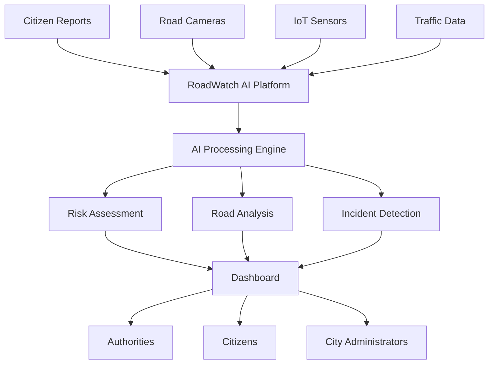
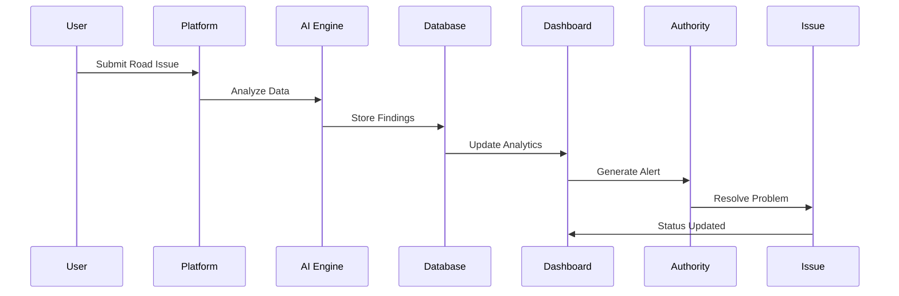

# 🚦 RoadWatch AI

### AI-Powered Smart Road Safety & Infrastructure Intelligence Platform


<p align="center">
  
  
  
  
</p>

<p align="center">
  <b>Making Roads Safer Through Artificial Intelligence, Data Analytics & Real-Time Monitoring</b>
</p>

---

## 🌍 Overview

RoadWatch AI is an intelligent road safety platform designed to identify, analyze, and report road hazards using AI-driven technologies.

The platform helps citizens, authorities, and transportation agencies monitor road conditions, detect safety issues, analyze accident-prone areas, and improve infrastructure planning through actionable insights.

---

## ✨ Key Features

### 🚧 Hazard Detection

* Pothole identification
* Road damage reporting
* Unsafe road condition alerts
* Infrastructure issue tracking

### 🤖 AI-Powered Analysis

* Risk assessment engine
* Severity prediction
* Smart recommendations
* Pattern recognition

### 🗺️ Interactive Mapping

* Geolocation tagging
* Incident visualization
* Heatmaps
* Route intelligence

### 📊 Analytics Dashboard

* Safety metrics
* Trend analysis
* Incident statistics
* Performance indicators

### 📱 Citizen Reporting

* Upload images
* Submit incidents
* Real-time feedback
* Community participation

### 🏛 Authority Panel

* Issue management
* Priority assignment
* Resolution tracking
* Infrastructure planning

---

## 🎯 Problem Statement

Road accidents and infrastructure failures remain major challenges worldwide.

Traditional reporting systems often suffer from:

* Delayed reporting
* Manual inspections
* Lack of centralized data
* Poor resource allocation
* Limited predictive capabilities

RoadWatch AI addresses these issues through intelligent automation and data-driven decision-making.

---

## 💡 Solution

RoadWatch AI combines:

* Artificial Intelligence
* Computer Vision
* Geospatial Analytics
* Real-Time Monitoring
* Interactive Dashboards

to create a comprehensive road safety ecosystem.

---

## 🏗 System Architecture



---

## 🔄 Workflow



---

## 🛠 Tech Stack

### Frontend

* React.js
* Next.js / Vite
* TypeScript
* Tailwind CSS
* ShadCN UI

### Backend

* Node.js
* Express.js

### Database

* MongoDB
* Firebase

### AI / ML

* OpenAI APIs
* Computer Vision Models
* Predictive Analytics

### Mapping

* Google Maps API
* Leaflet
* OpenStreetMap

### Deployment

* Vercel
* Netlify
* Firebase Hosting

---

## 📂 Project Structure

```bash
RoadWatchAI/
│
├── public/
├── src/
│   ├── components/
│   ├── pages/
│   ├── services/
│   ├── hooks/
│   ├── context/
│   ├── utils/
│   └── assets/
│
├── docs/
│   ├── ARCHITECTURE.md
│   ├── DESIGN.md
│   ├── IMPLEMENTATION.md
│   └── PROMPT.md
│
├── package.json
├── README.md
└── LICENSE
```

---

## 📈 Future Roadmap

### Phase 1

* Hazard Reporting
* Dashboard
* Maps Integration

### Phase 2

* AI Road Damage Detection
* Predictive Risk Analytics
* Smart Recommendations

### Phase 3

* IoT Integration
* Smart Traffic Insights
* Government Collaboration

### Phase 4

* National Road Intelligence Network
* Autonomous Monitoring
* Digital Twin Infrastructure

---

## 🔒 Security Features

* Role-Based Access Control
* Secure Authentication
* Encrypted Data Storage
* API Security Layer
* Audit Logging

---

## 📊 Impact

### Citizens

* Safer roads
* Faster issue reporting
* Better transparency

### Government

* Efficient resource allocation
* Data-driven planning
* Reduced accidents

### Cities

* Smart infrastructure management
* Predictive maintenance
* Improved mobility

---

## 🤝 Contributing

We welcome contributions from developers, researchers, designers, and road safety enthusiasts.

```bash
git clone https://github.com/Devengoyal885/Arclight_RoadSafety_RoadwatchAi.git

cd Arclight_RoadSafety_RoadwatchAi

npm install

npm run dev
```

---

## 📜 License

This project is licensed under the MIT License.

---

## 👨‍💻 Author

### Deven Goyal

* Full Stack Developer
* AI Research Enthusiast
* Hackathon Winner
* Open Source Contributor

GitHub:
https://github.com/Devengoyal885

LinkedIn:
https://linkedin.com/in/deven-goyal

Portfolio:
https://devengoyal.netlify.app

---

## ⭐ Support

If you find this project useful:

⭐ Star the repository

🍴 Fork the project

🚀 Share with others

📢 Contribute to making roads safer

---

<p align="center">
Built with ❤️ by Deven Goyal
</p>
